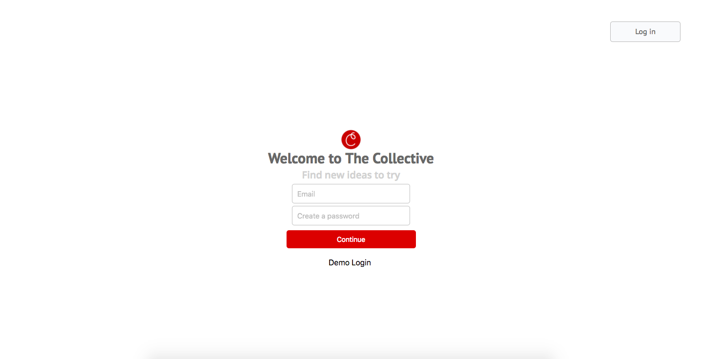

# README

## The Collective

The Collective is inspired by Pinterest, using the idea of collecting images so that you can save and share them with those you follow or that follow you.

    

To get started, run bundle exec rails db:setup, bundle exec rails db:seed, and npm install.

This is the welcome page:

There is a demo login for a seeded account.

Implementing the upload of images for items took the use of the Paperclip gem. You can upload via file or url (will upload image of this in the future. Currently down).

Preserving the images on AWS using paperclip presented a particular challange, but using the FormData class was the solution to my problem of formatting the data that included both the image information from paperclip, as well as the rest of the information from the item.

Accounting for automatic refresh, aka upon change state was another difficulty that was solved by sending formatting my json with adequate user information to which my reducers could add the appropriate information. This methodology was used for collections and items.

Follows will soon be implemented so that only the items saved by a followed person will appear in the home feed.

Search, notifications, and messaging are features to come.
